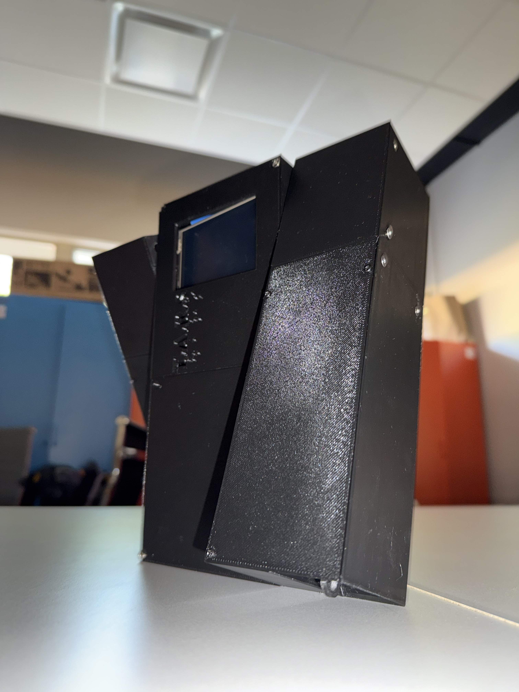
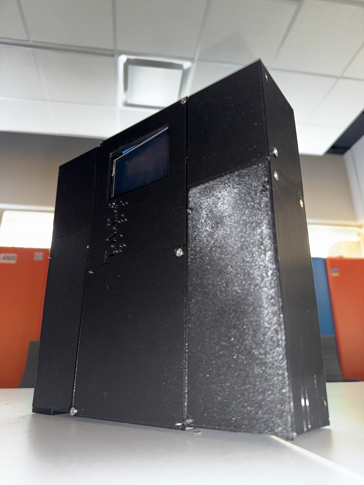
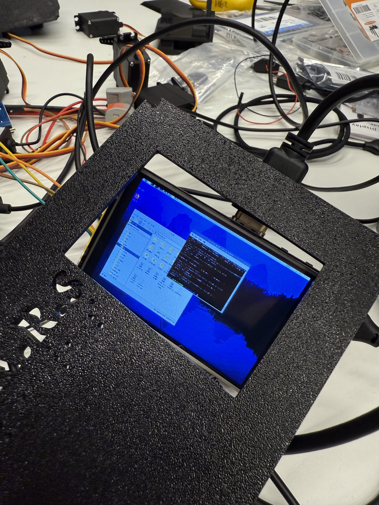

# TARS
A real-life version of the robot TARS from the motion picture *Interstellar*; created as a HackKU hackathon project.
- [Project Devpost Page](https://devpost.com/software/tars-1b3cwz)
- [HackKU 2025 Devpost](https://hackku-2025.devpost.com/)
- [HackKU Website](https://www.hackku.org)

<span>



</span>


# Table of Contents
- Credits
- Dependencies
- Build Steps

# Dependencies
Dependencies can be found within the [requirements](REQUIREMENTS.txt) file, and can be batch installed with the following `pip` command:

```bash
pip install -r REQUIREMENTS.txt
```

# Credits
- 3D Model (***BASE***): [TARS-AI](https://docs-tars-ai.vercel.app/build/3d_print)
- i2samp.py: [Adafruit](https://github.com/adafruit/Raspberry-Pi-Installer-Scripts/raw/main/i2samp.py)
- TARS "backstory" system prompt segment: [TARS Fandom page](https://interstellarfilm.fandom.com/wiki/TARS)

# Build Steps
To build/run the program, the following steps must be taken:
1. In the root repo directory, you must create a `.env` file with the following entries:
    - GEMINI_API_KEY
    - OPENAI_API_KEY
2. In the root directory, run the following command:
```bash
python src/main.py
```

# Software Components
The major components of TARS' software can be found below.
## Top-Level Controller
At the top-most level, we have the main controller named `TARS`. This is responsible for managing all the other controllers and holding the main runtime loop. It also is the source of truth for TARS' personality parameters.

## Wake Word Model
We used the `openwakeword` [Python package](https://github.com/dscripka/openWakeWord) and [trained](https://github.com/dscripka/openWakeWord?tab=readme-ov-file#training-new-models) our own custom ONNX model to "wake" TARS from an idle state to be actively listening for commands.

We also trained verifier models to further improve the performance and accuracy of the wake phrase's activation, allowing us to select exactly who TARS responds to.

## Speech-to-Text Controller
We initially utilized AssemblyAI to transcribe the user's commands/questions to TARS, that were then passed on to the Google Gemini model. In the final project, we decided to run the speech recognition on-board using `vosk` [speech recognition](https://alphacephei.com/vosk/) so that it was able to run offline.
<!-- Add stuff here -->

## Conversational Controller
We utilized Google Gemini API for TARS' conversationalism and action control. We went with the `gemini-2.0-flash` model, as it best suited our use case with good reasoning and also good speed.
<!-- Add stuff here -->

## Text-to-Speech Controller
We utilized [OpenAI's text-to-speech API](https://platform.openai.com/docs/guides/text-to-speech) to give TARS a voice. The exact model we used was `gpt-4o-mini-tts`, with the `onyx` voice. We also noticed that utilizing `tts-1` allowed for a *much* more accurate and "real" voice; however, we prioritized speed.

We also utilized the `pyttsx3` package for the off-chance that we are unable to access OpenAI's model due to being offline.

## Servo Controller
<!-- Add stuff here -->

# Hardware Components
The major components of TARS' hardware can be found below.
## Microcomputer
<!-- Add stuff here -->
## Servos
<!-- Add stuff here -->
## Screen
<!-- Add stuff here -->
## Battery
<!-- Add stuff here -->
## Speaker and Amplifier
<!-- Add stuff here -->
- Speaker: MakerHawk
- Amplifier: [WWZMDiB MAX98357 I2S Amplifier Module](https://www.amazon.com/WWZMDiB-MAX98357-Amplifier-Unfiltered-Raspberry/dp/B0BTBS5NW2)
## Microphone
<!-- Add stuff here -->
## 3D Prints
<!-- Add stuff here -->

# Base Info
- Python 3.10.11
- Raspbian <!-- Add version here -->
<!-- Add more stuff here -->

